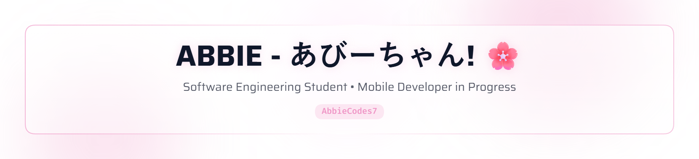

<picture>
  <source media="(prefers-color-scheme: dark)" srcset="./header-dark.png">
  <source media="(prefers-color-scheme: light)" srcset="./header-light.png">
  
</picture>

 

# 🌸 Hey there, I'm Abbie!

### 💻 Software Engineering Student • 📱 Aspiring Mobile Developer • 🌱 Lifelong Learner

 

---

## 🌸 About Me

<table>
<tr>
<td width="65%">

Hi! I'm **Abbie**, a Software Engineering student at **MIVA Open University**.

I'm currently focusing on **Mobile Application Development** and working on becoming a stronger software engineer by learning through projects and hands-on practice.

I'm especially interested in:

* 📱 Mobile Application Development
* 💻 Software Engineering
* 🧠 Computer Science
* ⚙️ Embedded Systems & IoT
* 🤖 Artificial Intelligence & Machine Learning
* 🏥 Health Technology
* 🎓 Computer Science Research & Education

I'm currently transitioning from simply **learning about technology** to actually **building with it**.

My long-term goal is to pursue graduate studies in Computer Science, contribute to research, teach, and build technology products that solve real-world problems.

 

> 🌱 **Build. Learn. Improve. Repeat.**

</td>

<td width="35%" align="center">

  

**Currently learning**

📱 Android Development
💜 Kotlin / Java
🐙 Git & GitHub
🧩 Software Engineering

</td>
</tr>
</table>

---

# 🚀 What I'm Currently Learning

### 📱 Mobile Development

### 💻 Programming & Development

### 📚 Current Focus

* Android application development
* Kotlin / Java
* User interface development
* APIs & data handling
* Databases
* Git & GitHub
* Object-oriented programming
* Data structures & algorithms
* Software engineering fundamentals

---

# 🧠 Areas of Interest

| 📱 Mobile Development | 💻 Software Engineering |
| :-------------------: | :---------------------: |
|  Android Applications |  Software Architecture  |
|       Mobile UI       |       Programming       |
|          APIs         |     Data Structures     |
|       Databases       |      System Design      |

| ⚙️ Emerging Technology |    🔬 Future Interests    |
| :--------------------: | :-----------------------: |
|    Embedded Systems    | Computer Science Research |
|           IoT          |  Artificial Intelligence  |
|        Robotics        |    University Teaching    |
|       Health Tech      |    Technology Education   |

---

# 📂 Learning Projects

I believe the best way to learn software engineering is to **build**.

### 🪨 Rock Paper Scissors — Python CLI

A command-line game built with Python using randomization, user input, and conditional logic.

**Tech:** Python

---

### 🍽️ CLI Restaurant Ordering System

A terminal-based restaurant ordering system that allows users to:

* View the menu
* Place orders
* Calculate the total bill

**Tech:** Python

---

### 🔐 Simple Login System

A beginner Python project demonstrating:

* User input handling
* Password validation
* Login attempt limitation

**Tech:** Python

---

### 🚀 More Coming Soon...

I'm currently working toward building more complete applications as I continue my journey into **mobile development and software engineering**.

---

# 🛠️ Tech Stack

### Languages

### Mobile & Development

### Exploring

---

# 📊 GitHub Stats

  

  

---

# 📈 My Development Journey

---

# 🐍 Contribution Snake

<!-- Contribution Snake -->

<!-- This section can be generated automatically using the GitHub Action:
     https://github.com/Platane/snk -->

---

# 🎯 2026 Goals

* 📱 Build my first complete Android application
* 💜 Develop a strong foundation in Kotlin / Java
* 💻 Strengthen my software engineering fundamentals
* 🐙 Build a consistent GitHub portfolio
* 🚀 Complete meaningful personal projects
* 🧠 Improve problem-solving and programming skills
* 🌐 Build my professional online presence
* 🤝 Explore open-source contribution
* 🎓 Prepare for life after my Software Engineering degree

---

# 🌱 My Long-Term Vision

I want to grow from a **Software Engineering student** into a technology professional who can both **build and teach**.

My long-term academic and professional interests include:

🎓 Graduate studies in Computer Science
🔬 Computer Science research
👩🏽‍🏫 University teaching & academia
💻 Software engineering
📱 Mobile technology
🚀 Technology entrepreneurship

I hope to eventually work across **industry, research, education, and technology entrepreneurship**.

---

# 🌐 Let's Connect

---

### 🌸 Thanks for visiting my profile!

**I'm still learning. I'm still building. I'm just getting started.**

 

